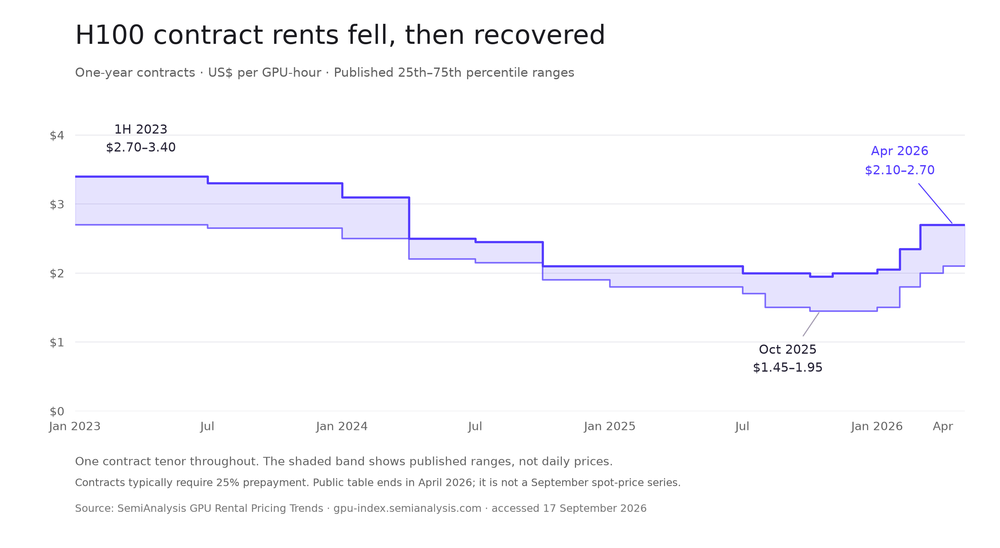

# Open Silicon：GPU 市场 thesis 红蓝队研究

研究截止：2026-09-17，美国太平洋时间。范围：公开市场证据、融资产品与交易、偿债逻辑。本文没有修改 deck，也没有把任何外部公司列为 Open Silicon 的客户或合作方。

**补充更新：**后续已加入租价对应的回本测算，以及 NVIDIA 的容量承诺、选择性残值支持、BlackRock 和其他机构融资交易。机构参与不仅是竞争，也是融资生态深化的正面证据。最新 Market 提纲及结论以[补充研究](payback-and-institutional-support.md)第 5 节为准。

**结论：GPU 租赁需求商业化与融资市场分层有较强证据；“小运营商普遍无钱可借”和“6–12 个月自然能够无尾款退出”不能成立为已验证结论。可以继续推进的 thesis，应当聚焦特定借款人的短期资金用途、可核验的经营回款和可实现的净抵押物价值。**

本次由三名独立 agent 分别担任蓝队、红队和融资证据审计员，先独立研究，再交换最强证据交叉质询，最后由主审复核关键原始来源与计算。蓝队接受了竞争证据，红队接受了真实需求增长；分歧收敛在“Open Silicon 是否有可盈利服务的具体借款人群体”，这仍需要私有交易数据。

## 1. 哪些论点保留，哪些需要收窄

| 原论点 | 裁决 | 可以采用的表述 |
|---|---|---|
| GPU 租赁需求正在增长 | 有支持，限于已观察运营商 | 多家运营商已把需求转化为确认收入；需要进一步验证目标借款人的收款 |
| GPU 市场是持续的卖方市场 | 过度概括 | 不同型号、合同期限和可交付配置有不同定价，长期价格存在周期 |
| 大 deals / 小 deals 需要不同融资 | 基本成立，但规模不是充分解释 | 客户信用、合同可执行性、资产运营状态、资金用途共同决定融资方式 |
| 银行不碰 GPU、小 deals 没人做 | 绝对表述被反例推翻 | 既有融资覆盖部分小额项目；剩余缺口需要逐笔证明 |
| 没有 hyperscaler off-take 就借不到钱 | 被现有产品与交易反驳 | 高信用客户改善融资条件；其他收入模式仍有融资渠道 |
| 储备金、现金归集、全额摊还构成独特优势 | 未成立 | 这些是风控要求；差异化需要额外证据 |
| 13–16% 是可能成交的借款人票息区间 | 有相近成交，但不能外推 | 可作为待承销的风险定价，不能当作已验证的 Open Silicon 市场报价或 LP 净收益 |
| 短期限限制风险，所以可以不依赖再融资 | 仅前半句有条件成立 | 缩短敞口期限，同时提高月度偿债压力；必须逐月验证本金可摊还 |
| Crypto LP 正在寻找本产品、愿意接受本条款 | 尚未验证 | 有 crypto-native 机构参与 GPU 信贷的证据；本池需求仍需实际 LP 意向 |

下文给出各项裁决的来源、限制和投资含义。没有发现支持证据不等于证明需求不存在；发现一个融资反例也不等于所有借款人都已被充分服务。

## 2. 需求证据：先看收入，再看未来订单

| 观察对象 | 可核验的商业化事实 | 能说明什么 / 不能说明什么 |
|---|---|---|
| CoreWeave | 2026 Q2 收入 $2.575B，上年同期 $1.212B | 支持已确认需求增长；收入不是借款人可分配现金。[2026-08-11 SEC 业绩公告](https://www.sec.gov/Archives/edgar/data/1769628/000176962826000362/coreweave2q26earningspress.htm) |
| Nebius AI Cloud | 2026 Q2 收入 $574.9M，同比增长 514% | 支持另一家运营商的商业化增长；不能代表小运营商平均盈利能力。[2026-08-12 股东信](https://www.sec.gov/Archives/edgar/data/1513845/000110465926094568/tm2622968d1_ex99-2.htm) |
| IREN AI Cloud | 截至 2026 年 6 月季度收入 $70.5M，3 月季度 $33.6M | 增长也见于不同运营模式；这里只比较 AI Cloud，不混入挖矿收入。[2026-08-27 FY26 业绩](https://iren.gcs-web.com/news-releases/news-release-details/iren-reports-fy26-results) |
| Runpod | 2026-01-20 宣布 $120M ARR | 提供开发者及弹性算力市场的补充证据；ARR 不是全年已确认收入，也不是单一 GPU host 的回款。[公司公告](https://www.runpod.io/press/runpod-ai-cloud-surpasses-120m-in-arr) |

**红队限制：**这些样本包含成功且能公开披露的运营商，存在选择偏差。不能从它们推导全行业付费出租率、目标 $5M–$40M 设施的平均回本期，或可放贷项目数量。

CoreWeave 同期经营现金流为 $679M，其中递延收入增加 $790M；其约 $104B backlog 仍受交付及服务可用性条件约束。这说明确认收入、客户预付、未来订单和可偿债现金必须分开。[同一 SEC 公告](https://www.sec.gov/Archives/edgar/data/1769628/000176962826000362/coreweave2q26earningspress.htm)

**可进入 deck 的结论：**“GPU rental demand is converting into recognized revenue across multiple operators.” 后面接借款人自己的付费出租率、发票和银行回款。

## 3. 价格证据：更长周期确实能看到趋势

建议主图采用 **SemiAnalysis 的 H100 一年期合同价格区间**。公开表覆盖 2023 年上半年至 2026 年 4 月，共 18 个报告期间。它提供的是 25–75 分位区间，通常假定 25% 预付，不能称为成交均价或每日现货指数。[原始价格表](https://gpu-index.semianalysis.com/)



读图结论是 **长期下行，随后部分回升**。这足以支持“价格有周期、合同定价发生变化”；不能证明恢复至早期水平、全市场短缺，或近期上涨必然持续。不要仅截取上涨段来论证信用安全。

数据与图形：[CSV](h100-one-year-contract-ranges.csv) · [可缩放 SVG](h100-contract-trend.svg)。图的阶梯覆盖各自报告期间，不是补出来的逐日路径。公开合同表止于 2026 年 4 月，不能当作 9 月的现价。

近期情况应作为独立小图：Silicon Data 报告 2026-05-04 至 07-27，H100 neocloud 按需指数上涨 7.0%，H200 上涨 14.4%；H200 官方历史只从 5 月开始。它与上述一年期合同价格不是同一个序列。[2026-08-04 型号比较](https://www.silicondata.com/blog/h200-vs-h100-rental-prices-may-july-2026)

方法论也是限制：Silicon Data 在 2025-12-05 宣布扩充样本并修改 A100/H100 指数标准化方法。跨版本分析应核实历史是否按新方法回算。[方法更新公告](https://www.silicondata.com/news-room/silicon-data-announces-major-revision-to-a100-h100-rental-indices-launches-first-ever-b200-index-and-introduces-new-hyperscaler-rental-benchmarks)

Runpod 2026-09-12 的定价说明明确描述了不同 GPU 价格有涨有跌、根据各型号供需调整。这进一步限制“所有 GPU 都是卖方市场”的说法。[运营商定价说明](https://www.runpod.io/blog/how-we-think-about-pricing-at-runpod)

**图表取舍：**主图固定型号、合同期限、货币与数据来源。按需、可中断 spot、长期预付合同分别画；不要把它们拼接成一条更有说服力的上涨线。也不要将租金图等同于二手硬件价格图。

## 4. 市场分层：把“大小”升级为融资可行性分析

以下是我们的分析框架，不是已经量化的市场份额。

| 维度 | 大型长期容量合同 | 已运营的较小集群 | 纯按需 / 现货敞口 |
|---|---|---|---|
| 收入可见性 | 取决于客户信用、最低承诺、解约权与交付条件 | 取决于合同组合、续约、付款及服务表现 | 订单可快速变化，未来收入可见性较低 |
| 主要资金用途 | 建设、供电、设备采购和大规模扩张 | 已投设备资金占用、营运资金或特定短期流动性 | 运营缓冲、承受空置和重新定价 |
| 可以观察的融资渠道 | 银团、资产融资、客户预付 | 设备租赁、专业信贷、部分银行与协议融资 | 也有资产融资产品；需更审慎测算现金流 |
| Open Silicon 的测试方向 | 作为市场参照 | 优先验证真实用途、现金流和可提供条件 | 纯未签约需求不能支撑确定的还款承诺 |

规模、合同期限和客户信用应分别记录。大运营商也会做短租，小运营商也可能拿到多年合同。Lambda 的产品文档同时区分按需、集群预约和多年 private cloud，支持这种合同分层。[计费文档](https://docs.lambda.ai/public-cloud/billing/) · [Private Cloud 文档](https://docs.lambda.ai/private-cloud/)

应在 deal 数据中分别记录：设施总投资、可抵押硬件价值、租赁合同金额、申请贷款本金。原始 mandate 的“$5M–$40M facilities”仍需要明确价值口径，不能直接当作贷款 ticket 或市场规模。

## 5. 真实融资反例：小额资金与替代产品已经存在

此表是外部市场 precedents，不是 Open Silicon 的交易业绩。票息、浮动利差、合同总付款、承诺额度和已提款本金使用不同口径。

| 交易 | 日期 / 资金状态 | 已披露结构 | 对 thesis 的含义 |
|---|---|---|---|
| QumulusAI / USD.AI | 2026-02-13 与 04-17，实际提款约 $4.282M / $16.4M | 分别到期于 2029 年 2 月 / 4 月；所引附注未披露两笔准确票息 | 已有单笔数百万美元 GPU 信贷。[SEC Q2 10-Q，Note 14](https://www.sec.gov/Archives/edgar/data/2084026/000143774926028924/quma20260630_10q.htm) |
| QumulusAI / USD.AI | 2026 年 8 月，$15.3M 已放款 | 贷款人报告固定 15%；设备安装并独立核查后放款 | 支持类似票息存在成交，但不证明借款人接受短期全额摊还。[9 月 1 日贷款人报告](https://usd.ai/insights/august-recap-100m-facility-susdai-ath) |
| Corvex / USD.AI | 2026 年 8 月，$7.5M 已放款 | 固定 10%，三年，已交付并投运 B200 | 同等量级贷款已有价格竞争。[同一贷款人报告](https://usd.ai/insights/august-recap-100m-facility-susdai-ath) |
| QumulusAI / TFC | 2026-05-07，签署设备租赁 | 三年固定付款总额约 $26M；交付起租；到期购买选择权 | 是替代融资。$26M 是租赁总付款，不是贷款本金或已投资本。[借款人公告](https://www.qumulusai.com/articles/qumulusai-secures-26m-multi-year-lease-financing-for-50-node-nvidia-b200-gpu-cluster) |
| Lambda | 2026-08-27，$926M facility closed，公告未单列提款 | SOFR +3.00%，全额摊还至 2030-12-31；投资级客户部署 | “常规 GPU 贷款都依赖 balloon”不准确。[借款人公告](https://lambda.ai/blog/lambda-closes-926-million-senior-secured-term-loan-b-facility) |
| IREN | 2026-08-27 公告 $2.8B 新 GPU 融资，未单列提款 | 其中 $2.4B 固定 9.0%；对应非投资级客户部署 | 高信用 hyperscaler 并非所有机构融资的必要条件；运营商实力仍重要。[FY26 业绩公告](https://iren.gcs-web.com/news-releases/news-release-details/iren-reports-fy26-results) |
| DigitalOcean | 2026-09-10，$725M 承诺设备融资 | 每次提款固定为期 SOFR swap +2.75%；按月全额摊还；有母公司等担保 | 银行与设备融资渠道活跃，但规模、担保及资产组合与本池不同。[SEC 8-K](https://www.sec.gov/Archives/edgar/data/1582961/000110465926106704/tm2625205d1_8k.htm) |

另一个速度反例：Macquarie 公布的 Fluidstack 案例称，GPU 抵押优先债务在数周内完成；页面未披露日期、金额或票息。它足以反驳“传统机构一律很慢”，不足以证明 Open Silicon 的目标客户都能拿到同样条件。[金融机构案例](https://www.macquarie.com/nz/en/insights/accelerating-investment-in-compute-infrastructure-for-fluidstack-a-leading-ai-cloud-platform.html)

最接近的公开产品是 USD.AI：无 off-take 或短于 24 个月合同的广告票息为 12–15%，另收 3% origination fee；36 个月等额本金、无提前还款罚金、三个月最高偿债额储备，并宣称少于 30 天完成。它是产品口径，不能当作每笔贷款的实际条款。[公开借款页面，9 月 17 日查阅](https://usd.ai/borrow)

其承销说明将最高 80% LTV 的分母定义为核实的采购成本。Open Silicon 提议的 60% 强制清算价值不能直接与之比较，必须换成一致的净回收价值口径。[2026-05-15 承销说明](https://usd.ai/insights/usdai-underwriting-and-risk-management)

**红蓝队共识：**资金用途、可执行资产控制、服务特定地区的能力和成交确定性，可能形成细分机会；目前都只是需要通过实际客户与竞品条款验证的假设。“没有竞争”和“短期限本身更有吸引力”不能作为结论。

## 6. 最重要的压力测试：贷款期限与回本周期能否匹配

Nebius 的 22 个月是管理层对新合同的预计回本期，使用收入确认口径，排除预付款，涉及未来成本与未建容量。它不是已验证的小运营商净现金回本期。[原始定义](https://www.sec.gov/Archives/edgar/data/1513845/000110465926094568/tm2622968d1_ex99-2.htm)

以下全部是**明确假设的数学敏感性**，不是市场事实、Open Silicon 交易数据或已批准 covenant：

- 已投设备及配套资本 C = 100；独立评估净强制清算价值 = 70。
- 按净清算价值的 60% 放款，贷款 L = 42。
- 年票息 14%，按月初未偿本金计息；每月等额本金。
- 可偿债现金 CFADS 恒定为 C/P；P 分别假设为 22、30、36 个月净现金回本期。
- CFADS 扣除经营支出、维护、现金税及营运资金需求，尚未扣贷款本息。
- 示例最低 DSCR = 1.25x。无预付、延迟收款、额外 capex、费用、资产出售或再融资。

| 假设净现金回本期 | 贷款 42、12 个月摊还的首月 DSCR | 6 个月贷款现金流上限，占原始 capex | 9 个月上限 | 12 个月上限 |
|---|---:|---:|---:|---:|
| 22 个月 | 1.14x | 20.39% | 29.62% | 38.28% |
| 30 个月 | 0.84x | 14.95% | 21.72% | 28.07% |
| 36 个月 | 0.70x | 12.46% | 18.10% | 23.39% |

即使示例抵押物测试允许贷出 capex 的 42%，现金流测试也可能只允许更小的本金。等额本息可以略改善初期负担，不能消除现金流约束。完整九组结果在[敏感性 CSV](illustrative-amortization-sensitivity.csv)。

计算式，月息 r = 14% / 12、期限 N、要求覆盖倍数 D：

```text
首月偿债额 = L/N + r × L
首月 DSCR = CFADS / 首月偿债额
等额本金现金流上限 = CFADS / [D × (1/N + r)]
等额本息现金流上限 = (CFADS/D) × [1 − (1+r)^(-N)] / r
初始贷款上限 = min(净抵押物限额, 压力现金流可摊还金额)
```

真实承销必须替换为每个月的实际收付款日历。合同已经预付而之后逐月确认的收入，不应再记为新的月度现金流；客户储备、借款人权益、抵押物和还款资金不能重复计算。

**这会改变产品叙事：**6–12 个月期限可以满足投资人期限偏好，但强制短期摊还会增加借款人负担。若现有长期贷款允许免费提前还款，借款人为何仍选 Open Silicon，需要可核验的答案。若到期必须依赖未承诺再融资，就应披露并定价该敞口。

## 7. 抵押物与 LP 端：剩余的关键证据缺口

**抵押物。** 抵押权、遥测和 collateral agent 不等于立即变现。需要设备序列号及产权、既有留置权、场地进入权、可操作的服务接管方案，以及实际批量销售的净回收报价。租金下降与硬件价值下降可能同源，不能把它们当成完全独立的保护。

Silicon Data 的 GPU residual value 产品采用租赁远期、成本、利用率衰减等输入进行 DCF 估值；它本身不是可执行的强制清算买价。[估值方法](https://www.silicondata.com/products/gpu-residual-value) 美国破产程序的自动中止也可能延缓追偿，交易所在地的处置计划需要单独验证。[美国法院官方说明](https://www.uscourts.gov/court-programs/bankruptcy/bankruptcy-basics/chapter-11-bankruptcy-basics)

本次未找到足以校准目标借款人群体统一 FLV haircut 的完整公开处置样本，即设备收回时间、批量出售收入、费用和最终债权回收率全部可核验。这是本次研究的证据边界，不是说历史上从未发生过此类回收。

**LP 需求。** Bullish 在 2026-08-28 公布向 USD.AI 提供 $100M stablecoin debt facility，支持 crypto-native 机构参与该资产类别，但不证明该额度全部已提款，也不证明 Open Silicon 的目标 LP 接受具体票息、费用和锁定期。[联合公告](https://usd.ai/insights/usdai-100m-bullish-gpu-financing-facility)

13–16% 借款人票息不能直接写成 LP 净回报。需要列明代理、法律、SPV、服务、监控、现金闲置、损失和费用承担人；短期贷款还涉及本金再投资或分配。对一个示例 14% 票息、12 个月等额本金贷款，总利息仅为初始本金的 7.583%，但按及时回款计算的月度 IRR 仍为 14%/12；二者并不矛盾。若本金及时分配，不能把 7.583% 误报成贷款年化 IRR；若留在池内闲置，也不能假设始终以 14% 生息。

## 8. 交叉质询后的结论

| 蓝队最强论点 | 红队质询 | 最终裁决 |
|---|---|---|
| 多家运营商收入增长，商业需求真实 | 成功企业样本能否代表目标借款人？ | 支持行业背景；贷款仍需独立核实收款 |
| 长期租金出现回升 | 是否挑选窗口、混合同口径？ | 使用同型号、同期限区间图，保留完整下跌阶段 |
| 小集群与大项目资本需求不同 | 小额融资已经存在，为何选择我们？ | 必须以借款人用途及替代方案证明细分需求 |
| 短期限、低 LTV、储备金保护债权 | 月度现金是否足够？控制是否能执行？ | 同时应用现金流限额与抵押物限额 |
| Crypto 资金有进入 AI 信贷的路径 | 本池的净回报和锁定期是否匹配 LP？ | 类别获验证，本池 LP 需求仍待直接验证 |

红队认可需求与合同分层，蓝队撤回普遍融资空白的主张。主审复算偿债模型，结果与红队一致。研究判断为：**值得继续做交易级验证；公开数据尚不足以证明 Open Silicon 已有独特、可规模化的信贷优势。**

## 9. 建议升级后的核心 thesis 与 Market 五页

建议英文核心文案：

> GPU rental demand is generating revenue across a range of contract structures. Open Silicon targets short-term liquidity needs at operating compute facilities, with loan size constrained by stressed cash collections and independently assessed net collateral value. Larger off-take contracts and refinancing may accelerate repayment; the base credit case must not require them.

这是一项拟执行的承销策略，不表示已经有符合条件的交易或资金承诺。

| 页 | 投资人结论 / 英文标题 | 图或证据 | 必须补充的自有证明 |
|---|---|---|---|
| 1 | Demand is converting into rental revenue | 多家运营商确认收入变化，未来 backlog 单列 | 目标借款人收款、合同及租户质量 |
| 2 | Rental prices move in cycles | 本报告 H100 同期限区间主图；近期按需价格另图 | 借款人实际租价与指数的差异 |
| 3 | Contract structure shapes financing access | 客户信用与合同确定性 × 资产运营状态；ticket 作为标注 | 已签合同、终止及扣减权、实际可获融资 |
| 4 | Collected cash determines debt capacity | CFADS 到月度本息的桥接，贷款两个上限 | 真实基础及压力情景、净清算报价 |
| 5 | Focus on a documented operating-asset financing need | 所选 pipeline 项目的用途、时限、竞品报价与选择理由 | 可审阅的真实交易材料与 LP 意向 |

公开交易可以证明存在融资市场；不要用外部大交易代替 Open Silicon 自己的获客与回款记录。涉及租金强势时，把范围限定到型号、期限和观测期间。

## 10. 下一步验证包与停止条件

### 应补齐的内部材料

| 待验证事项 | 需要的证据 | 达不到时如何处理 |
|---|---|---|
| 有真实融资需求 | 匿名借款人清单：贷款金额、用途、设备状态、所需日期 | 不做融资缺口规模估计 |
| 有客户选择我们的理由 | 同期书面竞品条款、拒绝原因、实际净提款与提前还款成本 | 不能把信贷质量问题包装成执行效率溢价 |
| 能在期限内摊还 | 发票对应银行回款，逐月 CFADS，租价及付费出租率压力情景 | 降低贷款、调整结构，或明确剩余再融资风险 |
| 抵押物可执行回收 | 独立批量报价、净费用、产权优先级、处置及接管计划 | 不使用未经核实的 FLV 与回收期限 |
| Pool 对 LP 有吸引力 | 费用瀑布、本金分配/再投资规则、集中度、实际 LP 条件 | 不宣称净回报与短期流动性已确定 |

没有给这些待验证字段编造数字，也未发起任何外部访谈。后续访谈若需要联系潜在借款人、贷款人或 LP，应由团队决定具体对象和沟通内容。

### 核心停止条件

1. 还款依赖未签新合同、租金持续上涨、未承诺再融资或未承诺新权益，且拟议产品仍宣称无到期尾款依赖。
2. 无法核实净清算价值、抵押优先级、收款控制或恢复运营所需现金。
3. 合格借款人持续选择更合适的现有方案，Open Silicon 的需求主要来自基本信用条件不合格的申请人。
4. 扣除真实成本与资金闲置后，LP 条件或平台经济性无法成立。

满足条件的意义是继续推进真实交易，不是仅凭市场叙事批准投资。
