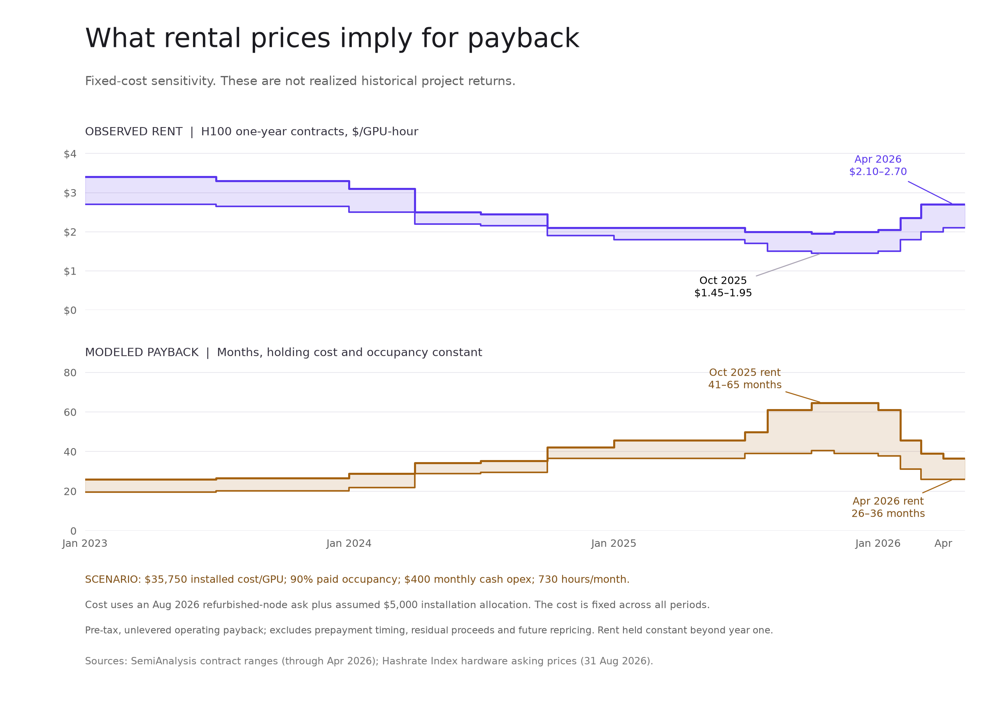

# GPU 回本周期与机构融资支持：补充研究

研究截止：2026-09-17，美国太平洋时间。延续三名 agent 的蓝队、红队和独立数据核验，并由主审复核关键披露及计算。本文为研究稿，未修改 app，也不将外部机构表述为 Open Silicon 的客户、投资人或合作方。

**更新判断：用户提出的两点都应加入。租价需要转化为资本回收能力；机构融资也应作为正面证据。尤其 NVIDIA 已披露容量采购承诺，并提出选择性的残值支持机制，这比一般的行业背书更有信用意义。** 但这类支持属于合同覆盖的项目，不是全部 GPU 租金或二手价格的统一下限。

## 1. 根据价格估算回本周期

### 计算口径

```text
每 GPU 月收入 = 每小时租价 × 730 × 付费出租率
每 GPU 月经营现金 = 月收入 − 全部经常性现金运营成本
静态经营回本月数 = 每 GPU 已投资本 / 每 GPU 月经营现金
```

这里的付费出租率是有付费义务的容量占比，不是 GPU 芯片负载率。租户包下一台机器但暂时不运行任务，不应因此再次扣减收入。

这是税前、无杠杆的稳定经营情景：假设回款与当期服务匹配，没有额外营运资金占用，不计融资成本、现金税、未来追加资本支出和出售残值。真正的项目回本应从实际付款日起，逐月累计回款和支出，并计入上线爬坡、预付款时点、续约价格和维护。月经营现金不为正时，这个模型没有有限回本期。

### 采购成本有可引用的锚，其他输入仍需明确假设

Hashrate Index 在 2026-08-31 公布八卡风冷 HGX H100 整机的卖方要价中位数：新品 $324,438，翻新 $246,000，分别折合约 $40,555 与 $30,750/GPU。该指数没有统一 CPU、内存和存储配置，价格是要价，不是成交或强制清算买价。[数据及方法](https://beta.hashrateindex.com/blog/announcement-introducing-the-ai-hardware-price-index/)

一项独立卖方核对：SSP 的 8 月 26 日页面列出翻新八卡 H100 节点，指示价 $240,000，即 $30,000/GPU，明确为美国 ex-works，未含运输等到场成本。这支持成本量级，不是具有约束力的采购或回购报价。[卖方原始页面](https://sspglobal.ai/availability/nvidia-h100-availability)

主图采用以下**研究假设，不是行业标准或 Open Silicon 实际数据**：

| 输入 | 数值 | 性质 |
|---|---:|---|
| 翻新整机分摊硬件成本 | $30,750/GPU | 8 月 31 日卖方要价指数 |
| 额外网络、安装等初始投资 | $5,000/GPU | 假设；不代表每个项目都足够 |
| 合计情景投资 | $35,750/GPU | 上述两项相加 |
| 付费出租率 | 90% | 假设，不等于计算负载率 |
| 月现金运营成本 | $400/GPU | 假设，含电力、机房、网络、人员等；尚待实际账单替换 |
| 月小时数 | 730 | 365×24÷12 的建模约定 |

主图将这一套成本固定，仅变动租价，因此隔离出价格对回本的影响。它将 **2023–2026 的历史租价与 2026 年 8 月的采购成本锚**结合，不能称为同期新投资回本或历史项目实际收益。



### 价格变化对应的回本变化

| 历史租价对应期间 | H100 一年期租价区间，$/GPU-hour | 毛收入收回投资，月 | 扣假设运营成本后的经营回本，月 |
|---|---:|---:|---:|
| 2023 上半年 | 2.70–3.40 | 16.0–20.2 | 19.5–26.0 |
| 2025 年 10 月 | 1.45–1.95 | 27.9–37.5 | 40.6–64.7 |
| 2026 年 4 月 | 2.10–2.70 | 20.2–25.9 | 26.0–36.5 |

租价为公开 25–75 分位范围，通常假定 25% 预付，公开合同序列截至 4 月。[SemiAnalysis 原始表](https://gpu-index.semianalysis.com/) 较短回本对应较高租价。预付款影响现金时点，本表没有模拟其时点收益；一年合同之后保持同价同出租率属于假设，并无已签合同保证。

**能够表达的正面结论：在成本和付费出租率不变时，租金恢复会缩短回本周期，固定成本使净经营现金的改善幅度可能大于租价涨幅。** 不能把这些测算说成行业已经实现的回本速度。

对 2026 年 4 月 $2.10–2.70 的租价情景，同时使用新品与翻新成本锚：

| 硬件成本锚 | 加假设 $5,000 配套后的投资/GPU | 假设 90% 付费出租率、$400 月成本的回本 |
|---|---:|---:|
| 翻新 | $35,750 | 26.0–36.5 个月 |
| 新品 | 约 $45,555 | 33.2–46.5 个月 |

相同翻新成本情景，付费出租率降至 70% 时，回本延长至 36.5–53.1 个月。**租价、购入成本、出租率和现金成本必须一起展示。** 只挑最低采购价和最高短租价，会高估可持续回款。

### 可独立放进 deck 的运营商先例

Nebius 在 2026 Q2 股东信中称，新合同对应的预计回本从此前 2–3 年改善至 1 年 10 个月，涉及相关 capex 和经营成本。其口径按收入确认、排除预付款，使用预计成本及未来容量，也包含尚未建成容量。这是管理层预测，不是 H100 行业已实现平均值。[原始股东信及方法注释](https://www.sec.gov/Archives/edgar/data/1513845/000110465926094568/tm2622968d1_ex99-2.htm)

建议与测算并列为单独案例，不拼成同一条时间序列。资产全额回本与偿还较小的贷款本金是不同问题：多年资产回本本身不排除短期贷款，前提是贷款额及摊还表匹配现有现金流。

## 2. NVIDIA 的支持机制比上一轮覆盖的证据更强

| 机制 | 核验结果 | 对信用的意义 |
|---|---|---|
| 与六家机构的 compute 融资平台 | 2026-08-10 宣布与 Apollo、BlackRock、Blackstone、Brookfield、Goldman Sachs、KKR 合作，拟在未来动员超过 $500B 第三方资本；公告为 MOU，最终协议尚待完成 | 大型资本正在建立算力融资渠道；不是 $500B 已放款或 NVIDIA 兜底金额。[NVIDIA 公告](https://investor.nvidia.com/news/press-release-details/2026/NVIDIA-Partners-With-Apollo-BlackRock-Blackstone-Brookfield-Goldman-Sachs-and-KKR-to-Establish-AI-Compute-Infrastructure-Financing-Platforms-to-Mobilize-Over-500-Billion-of-Third-Party-Capital/default.aspx) |
| 选择性残值支持 | 8 月 11 日官方说明称，NVIDIA 在部分项目中可提供最高某项 opportunity 的 25% 的残值支持，逐项目评估 | 这是最接近“托底”的披露。公开口径没有把 opportunity 定义为 GPU 采购额、贷款本金或第一损失；不能换算为每台 GPU 保值 25%。[官方说明](https://blogs.nvidia.com/blog/nvidia-ai-factory-compute/) |
| AI cloud 容量承诺 | 最新 10-Q 披露，截至 7 月 26 日，相关承诺 $36B，通常六年。运营商可把容量转售给更高价第三方，承诺随容量使用减少 | 部分项目有额外的合同需求方，可降低未售容量风险；同一文件也确认有限、可选择、逐项目的残值支持。[SEC 10-Q](https://www.sec.gov/Archives/edgar/data/1045810/000104581026000075/nvda-20260726.htm) |
| CoreWeave 未售容量采购 | 2025-09-09 协议初始价值 $6.3B，NVIDIA 在适用条件下购买覆盖的未售容量至 2032-04-13 | 实际收入支持案例；有交付、服务及终止条件，并非 GPU 回购或贷款本金保证。[CoreWeave 8-K](https://www.sec.gov/Archives/edgar/data/1769628/000176962825000047/crwv-20250909.htm) |

这些金额不相加：它们分别是平台目标、支持机制、服务承诺和个别合同，口径及潜在重叠不同。

另一个容易混淆的披露是 NVIDIA 的 $105B Ohio 项目保证。其 SEC 附件虽然也叫 Residual Value Guaranty，标的实际涉及 Piketon 土地、厂房、电力和输电相关租约；不能用作 H100/B200 二手价格下限的证据。[保证文本](https://www.sec.gov/Archives/edgar/data/1045810/000104581026000075/nvda2027q2ex101.htm)

**最新状态核查：**8 月 27 日 Reuters 转述 WSJ 称部分收入分成支持交易暂停，同时刊出 NVIDIA 发言人的回应，称 7 月推出的模式仍在运行并继续调整。这是一项存在分歧的媒体报道，不证明已披露合同取消；也意味着不能把新项目支持写成无条件、全面开放的现成产品。[Reuters 报道及公司回应](https://finance.yahoo.com/news/nvidia-pauses-revenue-sharing-deals-223140237.html)

## 3. BlackRock 与其他机构：融资交易确实在深化

以下都是外部市场交易先例，不是 Open Silicon 过往业绩。额度、资本解决方案和企业价值不混为已支付现金。

| 日期 | 交易 | 已核实结构 | 对 thesis 的正面意义 |
|---|---|---|---|
| 2024-05-17 | CoreWeave $7.5B 债务融资 | Blackstone 主导，参与者包括 BlackRock 管理的基金和账户；公告为已签最终融资协议 | BlackRock 的参与确实包括 compute credit，不只有数据中心股权。[贷款方公告](https://www.blackstone.com/news/press/coreweave-secures-7-5-billion-debt-financing-facility-led-by-blackstone-and-magnetar/) |
| 2026-01-07 | Apollo / Valor / xAI | Apollo $3.5B 资本方案支持 $5.4B GB200 等设施收购及租赁，采用 triple-net 结构；NVIDIA 为 VCI 的 anchor LP | 已有成熟的设备所有权及租赁融资结构；两项金额包含关系，不能相加，LP 投资也不自动等于残值担保。[Apollo 公告](https://www.apollo.com/wealth/insights-news/pressreleases/2026/01/apollo-backs-5-4-billion-valor-and-xai-data-center-compute-infrastructure-transaction-with-3-5-billion-capital-solution-3214463) |
| 2026-02-09 | Firmus $10B 融资 | Blackstone 相关平台主导，Coatue 支持；未在公告披露全额提款、票息及详细担保 | Private credit 正在为区域性 AI 算力平台扩张提供资本。[借款人公告](https://firmus.co/newsroom/firmus-secures-us10-billion-financing-led-by-blackstone-and-coatue-to-scale-energy-efficient-ai-infrastructure) |
| 2026-03-31 | CoreWeave $8.5B DDTL 4.0 | 融资协议已完成交割，Blackstone Credit & Insurance anchor；浮息 SOFR+2.25%，另有约 5.9% 固息；GPU 基础设施及客户合同支持 | 合格资产已有投资级融资路径；总额度与初始可借金额不同，也不等于已全额提款。[借款人公告](https://investors.coreweave.com/news/news-details/2026/CoreWeave-Closes-Landmark-8-5-Billion-Financing-Facility-Achieving-First-Investment-Grade-Rated-GPU-backed-Financing/default.aspx) |
| 2026-07-21 | AIP / MGX / BlackRock GIP 收购 Aligned | 已完成全部股权收购，约 $40B 企业价值，并承诺另外 $5B 增长资本 | 证明长期机构资本进入实体基础设施；企业价值不是 BlackRock 单独投资额，也不是 GPU 抵押贷款。[交割公告](https://aligneddc.com/press-release/aip-mgx-and-blackrocks-gip-close-acquisition-of-aligned-data-centers/) |
| 2026-08-10 | CoreWeave $2.6B DDTL 5.5 | 融资协议已完成交割；约五年债务对应平均约三年的客户合同，SOFR+5.50%；母公司保证、抵押，后续适用最低 DSCR 1.35x | 最有意义的新证据：部分机构愿意承销续约或重新出租风险，融资不必全由同期限初始 off-take 覆盖。[公告](https://investors.coreweave.com/news/news-details/2026/CoreWeave-Closes-2-6-Billion-Loan-Facility-Expanding-Financing-Flexibility-for-AI-Infrastructure/default.aspx) · [SEC 条款](https://www.sec.gov/Archives/edgar/data/1769628/000176962826000357/crwv-20260807.htm) |

最后一笔尤其值得进入 Deals Overview。它比单纯“大机构投了多少钱”更能说明融资方式正在演变：客户可以签较短合同，机构仍可能在有其他信用保护的情况下提供更长期资金。该先例具有大型平台、母公司支持及资产组合，不能直接外推为任何小运营商都能取得相同条件。

## 4. “托底”怎样准确地进入 thesis

| 层次 | 证据强度 | Deck 可以表达什么 |
|---|---|---|
| 机构资金承认该资产类别 | 有多笔融资及平台安排支持 | Compute is becoming an institutional financing market. |
| 合同覆盖项目的收入支持 | 有具体已披露商业协议 | Capacity commitments can support cash flows for eligible projects. |
| 个别项目的残值支持 | NVIDIA 明确提出，实际保护取决于签署条款 | Selective vendor support can strengthen asset financeability. |
| 整个 GPU 租金或二手价格有统一下限 | 本次未找到这样的公开承诺 | 不把市场利好写成全行业保价 |

对 Open Silicon，这是**更深的潜在再融资市场与更丰富的信用结构**，是正面因素。我们可以在这个融资生态中服务特定的小额运营资产需求，而不必通过“所有机构都不愿意放款”来证明自身存在的理由。这是定位推论，仍需自己的客户及交易证明。

若某借款人确实拥有覆盖其设备的容量或残值支持，可将其纳入承销，但应按实际覆盖金额、现金时点和贷方权利计入。同一份容量不能同时计满第三方租户收入与 NVIDIA fallback 收入。没有该合同的资产只能享有间接市场利好，不能把支持金额加进清算估值或偿债现金。

资本增加也可能带来更多供给和贷款利差竞争，因此不从机构参与直接推出租价永远上涨。支持提供方、客户需求与硬件代际仍有共同风险。

## 5. 更新后的 Market 五页提纲

| 页 | 投资人看到的标题 | 证据与叙事 |
|---|---|---|
| 1 | Demand is converting into rental revenue | 用已确认收入呈现需求，不以采购计划替代收入 |
| 2 | Stronger rental pricing improves capital recovery | 长周期租价 + 明确标注假设的回本区间；Nebius 预计回本改善作为独立案例 |
| 3 | Different rental models create different capital needs | 长期容量合同、已运营小集群、按需租赁各自的资本用途与融资条件 |
| 4 | Institutional capital is establishing compute as a financeable asset | BlackRock、Blackstone、Apollo 的已公布交易；NVIDIA 融资平台目标单列 |
| 5 | Vendor support is strengthening selected financing structures | 容量承诺、选择性残值支持及更灵活的融资期限；引出 Open Silicon 的运营资产短期信贷定位 |

细致的 DSCR、费用瀑布和违约压力测试放到 Credit / Underwriting 节，Market 主线保持需求、经济性、融资生态的发展。对基准回款不依赖再融资的承诺，仍需在信用部分用逐月现金流验证。

建议本节核心句：

> **Institutional capital and selective vendor support are making compute assets more financeable. Open Silicon targets short-term credit needs at operating facilities within this expanding market.**

### 可复用附件

- [静态图 PNG](rental-price-and-payback.png) / [SVG](rental-price-and-payback.svg)
- [36 组租价与成本情景 CSV](rental-payback-sensitivity.csv)
- [24 组出租率及运营成本敏感性 CSV](payback-occupancy-cost-sensitivity.csv)
- [计算与制图脚本](payback-model.py)

新图为研究图，保留可审计假设。用于投资人页面时，实际 deal 数据未填的字段仍应按 deck 规则标记 TODO；不把示例输入升级为已核实交易事实。
